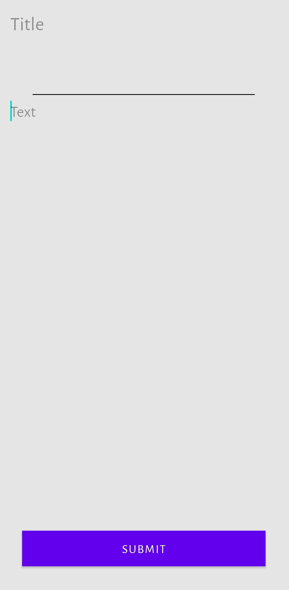
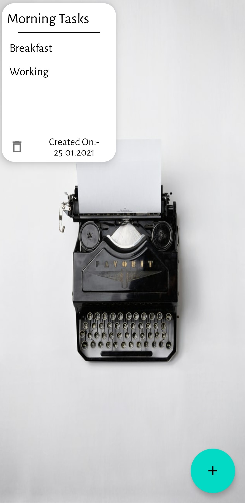
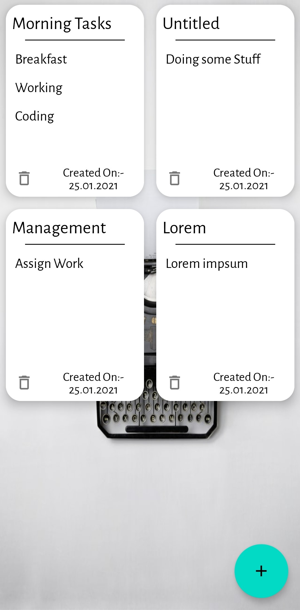

# Notes-Making-App

Hello Everyone ,
I created a notes making application which saves the notes in local database. The app supports editing the title or text of the pre-existing notes and rendering the changes at the same time. I used the following concepts in making of the app:-

1.Room Database
2.ViewModel
3.Recycler View
4.Intents

Here are the glimpse of the UI of the app:-

<h4>Home Screen without any Notes</h4>

  

<h4>Creating a note</h4>

  

<h4>Home Screen with first note</h4>

  

<h4>Multiple Notes</h4>

  

<h4>Editing a note</h4>

  

<h4>After Editing</h4>

  

